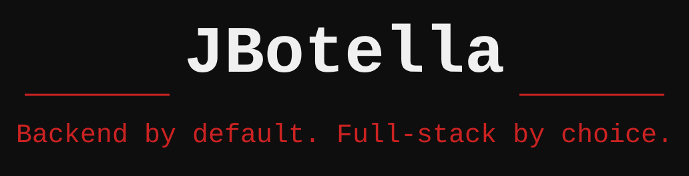

<picture>
  <source media="(prefers-color-scheme: dark)" srcset="assets/banner-dark.svg" />
  <source media="(prefers-color-scheme: light)" srcset="assets/banner-light.svg" />
  
</picture>

 

---

### Sobre mí

Desarrollador **Backend & Android** afincado en Málaga. Construyo APIs REST en Java/Spring Boot y aplicaciones Android nativas en Kotlin, y llevo ambas de local a producción: contenerización, CI/CD y observabilidad incluidos.

Estoy terminando el CFGS DAW en IES Politécnico Jesús Marín mientras desarrollo **TheMechanic**, un sistema de gestión de talleres con backend en Spring Boot 4 y cliente Android en Kotlin/Jetpack Compose. He pasado por la Diputación Provincial de Málaga y por MetaData S.L., donde diseñé y desarrollé el ecosistema de automatización sobre Ansible, Wazuh y Azure DevOps.

---

### Stack

**Lenguajes**

**Frameworks**

**Datos & infraestructura**

---

### Proyectos

**[TheMechanic](https://github.com/JaviBot00/TheMechanic-SpringBoot)** — API REST + app Android · Sistema completo de gestión de talleres. Backend en Spring Boot 4 con arquitectura por feature, JWT con roles, PostgreSQL, Flyway y OpenAPI. Cliente Android nativo en Kotlin con Jetpack Compose, Clean Architecture + MVVM, Hilt y Retrofit.
→ [Spring Boot](https://github.com/JaviBot00/TheMechanic-SpringBoot) · [Android](https://github.com/JaviBot00/TheMechanic-Android)

**[Laravel API Blueprint](https://github.com/JaviBot00/Laravel-API-Blueprint)** — Plantilla de API RESTful con JWT, permisos por roles, auditoría de acciones y documentación Swagger. Dockerizada y pensada como guía de migración desde Slim PHP.

**[RabbitMQ SMS System](https://github.com/JaviBot00/RabbitMQ-SMS-Python)** — Control de envío de SMS con RabbitMQ y delayed exchange en Python. Colas diferenciadas por tipo de usuario con ventanas de tiempo configurables y persistencia en MySQL.

**[Docker ELK Secure](https://github.com/JaviBot00/Docker-ELK-Secure)** — Entorno ELK (Elasticsearch, Logstash, Kibana) en Docker con seguridad optimizada para desarrollo local. Base del stack de observabilidad usado en producción.

---

Backend by default. Full-stack by choice.

